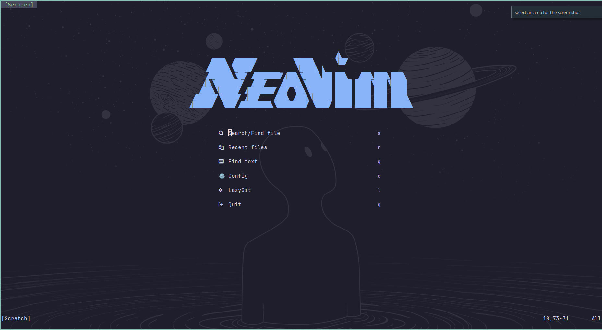

# My Dotfiles

## Pre-requisite

`gnu stow` - <https://www.gnu.org/software/stow/>

On Arch

```
sudo pacman -Sy stow
```

On Ubuntu

```
apt-get install stow
```

## Neovim

This will install the neovim config

```
stow nvim
```

After opening, neovim Lazy should start automatically downloading all the necessary plugins, let it finish first and restart neovim and it should be ready to go.

Should look something like this:


## Random Stuff

### Git Config for diff

```bash
git config --global diff.tool vimdiff
git config --global difftool.vimdiff.path nvim #if using neovim 
git config --global alias.d difftool
git config --global difftool.prompt false
```
