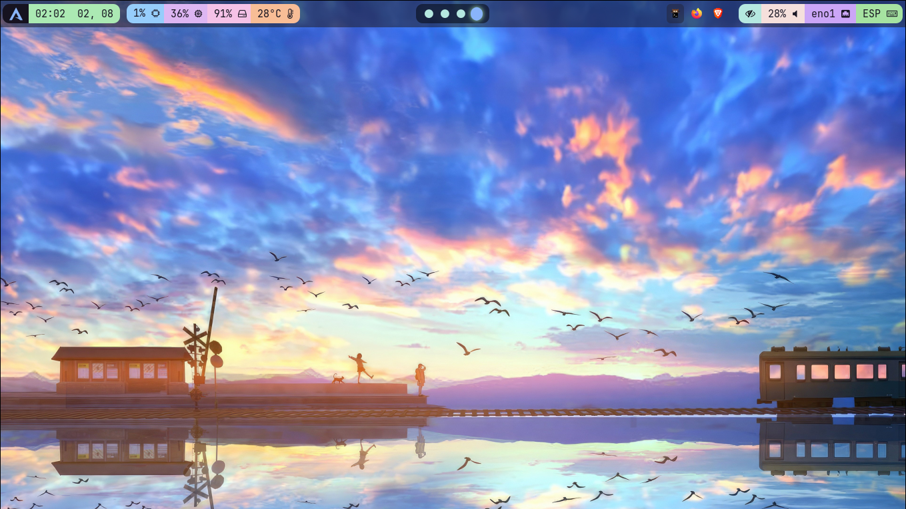

# WaybarTheme

🎨 A custom theme for [Waybar](https://github.com/Alexays/Waybar), designed for environments using Hyprland and other window managers compatible with status bars based on GTK and CSS.

---

## 📷 Screenshots

Reference image:


Full screen:



---

## 🚀 Installation

1. Clone this repository:
   ```bash
   git clone https://github.com/soaddevgit/WaybarTheme.git

2. Copy the files to your conf folder:
   ```bash
   cp WaybarTheme/* ~/.config/waybar/

---

⚙️ Requirements

🧭 Waybar

🔤 NerdFonts Font(recommended for better icon and glyph rendering)

🖥️ Hyprland (or any compositor compatible with Waybar)
    
    
---

📄 License

📝 MIT License

Feel free to use, modify, and share.

---

🙌 Credits

Inspired by other themes and community customizations:

🔗 [Mohammad's Configuration](https://github.com/mhdzli/dotfiles/tree/home/.config/waybar)

🔗 [woioeow's Configuration](https://github.com/woioeow/hyprland-dotfiles.git) :Style 1

🔗 [Whiteshadow's Configuration](https://github.com/elifouts/Dotfiles)

🔗 Wallpaper: [xtrafondos.com](https://www.xtrafondos.com/wallpaper/3840x2517/12224-paisaje-anime-arte-digital.html)

🤖 And quite a few AI-assisted queries.
